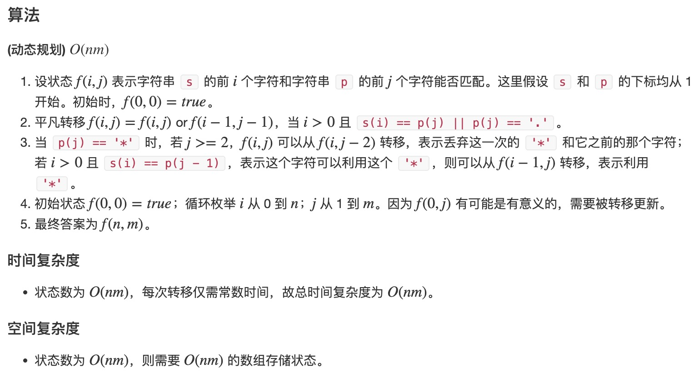

# 题目
给你一个字符串 s 和一个字符规律 p，请你来实现一个支持 '.' 和 '*' 的正则表达式匹配。

- '.' 匹配任意单个字符
- '*' 匹配零个或多个前面的那一个元素
所谓匹配，是要涵盖 整个 字符串 s的，而不是部分字符串。

# 代码
```
class Solution {
public:
    bool isMatch(string s, string p) {
        int n = s.size(), m = p.size();
        s = ' ' + s, p = ' ' + p;
        vector<vector<bool>> f(n + 1,vector<bool>(m + 1));
        f[0][0] = true;
        for(int i = 0;i <= n;i ++)
        {
            for(int j =  1;j <= m;j ++)
            {
                if(j + 1 <= m && p[j + 1] == '*') continue;
                if(p[j] != '*' && i) f[i][j] = f[i - 1][j - 1] && (s[i] == p[j] || p[j] =='.');
                else if(p[j] == '*'){
                    f[i][j] = f[i][j - 2] || (i && f[i - 1][j] && (s[i] == p[j - 1] || p[j - 1] == '.'));
                }
            }
        }
        return f[n][m];
    }
};
```
# 思路
