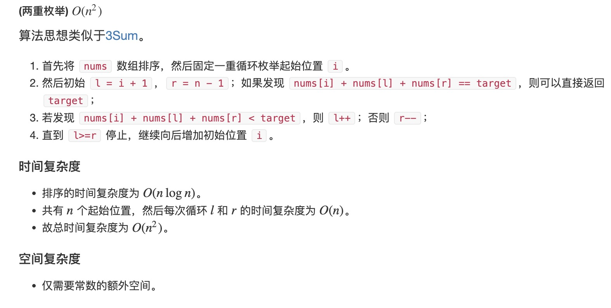

# 题目
给你一个长度为 n 的整数数组 nums 和 一个目标值 target。请你从 nums 中选出三个整数，使它们的和与 target 最接近。

返回这三个数的和。

假定每组输入只存在恰好一个解。

示例 1：
```
输入：nums = [-1,2,1,-4], target = 1
输出：2
解释：与 target 最接近的和是 2 (-1 + 2 + 1 = 2) 。
```
示例 2：
```
输入：nums = [0,0,0], target = 1
输出：0
```
# 代码
```c++
class Solution {
public:
    int threeSumClosest(vector<int>& nums, int target) {
        int ans = nums[0] + nums[1] + nums[2];

        sort(nums.begin(), nums.end());

        for (int i = 0; i < nums.size(); i++) {
            int l = i + 1, r = nums.size() - 1;

            while (l < r) {

                if (abs(nums[i] + nums[l] + nums[r] - target) < abs(ans - target))
                    ans = nums[i] + nums[l] + nums[r];

                if (nums[i] + nums[l] + nums[r] == target)
                    return target;
                else if (nums[i] + nums[l] + nums[r] < target)
                    l++;
                else
                    r--;
            }
        }

        return ans;
    }
};
```
# 思路
