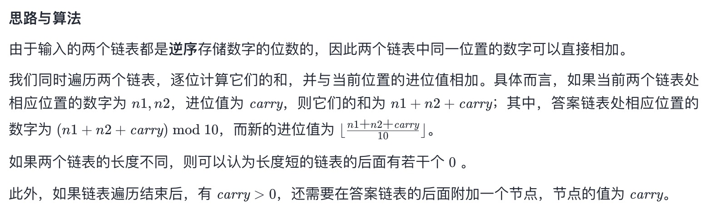

# 题目
给你两个 非空 的链表，表示两个非负的整数。它们每位数字都是按照 逆序 的方式存储的，并且每个节点只能存储 一位 数字。

请你将两个数相加，并以相同形式返回一个表示和的链表。

你可以假设除了数字 0 之外，这两个数都不会以 0 开头。

**示例 1：**
```
输入：l1 = [2,4,3], l2 = [5,6,4]
输出：[7,0,8]
解释：342 + 465 = 807.
```
**示例 2：**
```
输入：l1 = [0], l2 = [0]
输出：[0]
```
**示例 3：**
```
输入：l1 = [9,9,9,9,9,9,9], l2 = [9,9,9,9]
输出：[8,9,9,9,0,0,0,1]
```
# 代码
```c++
/**
 * Definition for singly-linked list.
 * struct ListNode {
 *     int val;
 *     ListNode *next;
 *     ListNode() : val(0), next(nullptr) {}
 *     ListNode(int x) : val(x), next(nullptr) {}
 *     ListNode(int x, ListNode *next) : val(x), next(next) {}
 * };
 */
class Solution {
public:
    ListNode* addTwoNumbers(ListNode* l1, ListNode* l2) {
        ListNode* dummy = new ListNode(-1);
        ListNode* tail = dummy;
        int t = 0;
        while(l1 || l2 || t)
        {
            if(l1) t += l1->val, l1 = l1->next;
            if(l2) t += l2->val, l2 = l2->next;
            tail = tail->next = new ListNode(t % 10);
            t /= 10;
        }
        return dummy->next;
    }
};
```
# 思路
