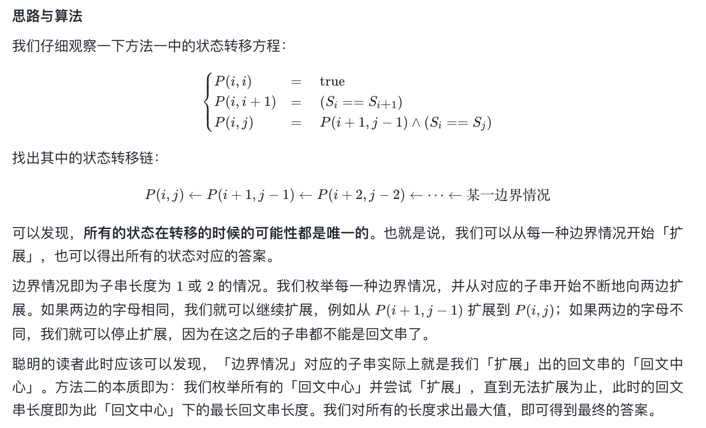

# 题目
给你一个字符串 s，找到 s 中最长的回文子串。
示例 1：
```
输入：s = "babad"
输出："bab"
解释："aba" 同样是符合题意的答案。
```
示例 2：
```
输入：s = "cbbd"
输出："bb"
```

# 代码
```c++
class Solution {
public:
    string longestPalindrome(string s) {
        string res;
        for(int i = 0;i < s.size();i ++)
        {
            int j = i - 1, k = i + 1;
            while(j >= 0 && k < s.size() && s[j] == s[k]) j --, k ++;
            if(k - j - 1 > res.size()) res = s.substr(j + 1, k - j -1);
            j = i, k = i + 1;
            while(j >= 0 && k < s.size() && s[j] == s[k]) j --, k ++;
            if(k - j - 1 > res.size()) res = s.substr(j + 1, k - j -1);
        }
        return res;
    }
};
```
# 思路
